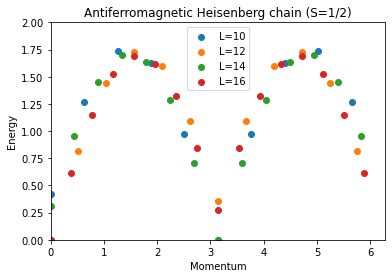
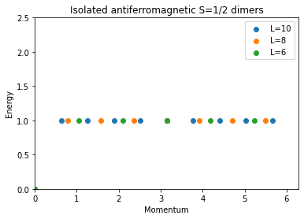

---
title: ED-03 Espectros
math: true
toc: true
---

## Espectros de energía de sistemas cuánticos 1D

En este tutorial calcularemos los espectros de energía del modelo cuántico de Heisenberg en varias redes unidimensionales. El trabajo principal lo realizará la aplicación `sparsediag`, que implementa el algoritmo de Lanczos, un solucionador de autovalores iterativo.
A diferencia de los cálculos de estado fundamental y de gap de los tutoriales anteriores, aquí calculamos varios autovalores de baja energía en *cada* sector de momento, de modo que podamos ensamblar el espectro de excitación completo $E(k)$ resuelto en momento. Este es el diagnóstico básico que se usa para identificar qué tipo de excitaciones tiene un modelo —una única rama de magnones dispersiva, un continuo de dos espinones, estados ligados de triplones con gap— simplemente observando la forma del espectro de baja energía en función de la geometría de la red y del acoplamiento.

Los tres ejemplos siguientes (cadena, escalera, dímeros aislados) son casos particulares del mismo hamiltoniano de Heisenberg sobre una escalera de dos patas,

$$
H = J_0 \sum_{\text{legs}} \mathbf{S}_i \cdot \mathbf{S}_j \; + \; J_1 \sum_{\text{rungs}} \mathbf{S}_i \cdot \mathbf{S}_j ,
$$

donde $J_0$ es el acoplamiento a lo largo de las dos patas y $J_1$ el acoplamiento a través de los peldaños; tomar $J_0=J_1$ da la escalera isótropa, $J_1=0$ da dos cadenas desacopladas, y $J_0=0$ da $L$ dímeros aislados de dos sitios. Esta familia de modelos, y el cruce entre sus límites, se discute por ejemplo en [E. Dagotto and T.M. Rice, Science 271, 618 (1996)](https://doi.org/10.1126/science.271.5249.618).

### Parámetros

| Parámetro | Significado | Valor |
|---|---|---|
| `LATTICE` | geometría incorporada | `chain lattice` (cadena) o `ladder` (escalera / dímeros) |
| `MODEL` | modelo de espín cuántico | `spin` |
| `local_S` | número cuántico de espín por sitio | 1/2 |
| `J` | acoplamiento a primeros vecinos (chain lattice) | 1 |
| `J0` | acoplamiento a lo largo de las patas (ladder lattice) | 1 (escalera) o 0 (dímeros aislados) |
| `J1` | acoplamiento de peldaño (ladder lattice) | 1 |
| `L` | tamaño lineal (número de peldaños en la escalera) | 10–16 (cadena), 6–10 (escalera/dímeros) |
| `CONSERVED_QUANTUMNUMBERS`, `Sz_total` | restringe al sector $S_z=0$ | `Sz`, 0 |

### Método

Usamos `sparsediag` porque necesitamos no solo el estado fundamental sino varios de los autovalores más bajos *en cada sector de momento* para construir $E(k)$; el algoritmo de Lanczos calcula directamente cualquier número solicitado de autovalores extremos de un hamiltoniano disperso, sin diagonalizar sectores que no nos interesan. El sector más grande aquí (cadena, $L=16$, $S_z=0$) tiene dimensión $\binom{16}{8}=12870$, perfectamente al alcance de la diagonalización dispersa iterativa, aunque demasiado grande para enumerarlo a mano.

### Cadena de Heisenberg

La `chain lattice` (incorporada en la [biblioteca de redes de ALPS](../../../documentation/intro/latticehowtos)) es un anillo periódico de $L$ sitios con acoplamiento uniforme $J$:

```
    J     J     J           J
o-------o-------o--- ... ---o
0       1       2          L-1
|_________________________________|
                J   (bond L-1 -- 0, periodic)
```

#### Preparando y ejecutando la simulación desde la línea de comandos

Primero, examinamos una cadena de espines S=1/2 con acoplamiento de Heisenberg. El archivo de parámetros <a href="../codes/ed-03-1dspectra/parm_chain" download>`parm_chain`</a> configura simulaciones ED para el sector S_z=0 de cadenas con {L=10,...16} espines.

```
LATTICE = "chain lattice", 
MODEL = "spin",
local_S = 0.5,
J = 1,
CONSERVED_QUANTUMNUMBERS = "Sz"
Sz_total = 0
{ L = 10; }
{ L = 12; }
{ L = 14; }
{ L = 16; }
```
    
Usando la siguiente secuencia de comandos puede ejecutar la diagonalización, y luego examinar el archivo de salida `parm_chain.out.xml` con su navegador.

```
parameter2xml parm_chain
sparsediag --write-xml parm_chain.in.xml
```

#### Preparando y ejecutando la simulación usando Python

Para configurar y ejecutar la simulación en Python, usamos el script <a href="../codes/ed-03-1dspectra/chain.py" download>`chain.py`</a>. Puede ejecutarlo en una terminal con `python chain.py`.
Observando las distintas partes del script, vemos cómo se preparan los archivos de entrada como una lista de diccionarios de Python tras importar los módulos requeridos.

```
import pyalps
import numpy as np
import matplotlib.pyplot as plt
import pyalps.plot

parms=[]
for l in [10, 12, 14, 16]:
    parms.append({ 
        'LATTICE'                   : "chain lattice", 
        'MODEL'                     : "spin",
        'local_S'                   : 0.5,
        'J'                         : 1,
        'L'                         : l,
        'CONSERVED_QUANTUMNUMBERS'  : 'Sz',
        'Sz_total'                  : 0
    })
```

A continuación, los parámetros de entrada se escriben en archivos de trabajo XML y se ejecuta la simulación `sparsediag`.

```
input_file = pyalps.writeInputFiles('parm_chain',parms)
res = pyalps.runApplication('sparsediag',input_file)
```
    
Para graficar el espectro, a continuación cargamos los archivos HDF5 producidos por la simulación

```
data = pyalps.loadSpectra(pyalps.getResultFiles(prefix='parm_chain'))
```
    
y reunimos las energías de todos los sectores de momento en un único DataSet para cada tamaño de sistema L. Para obtener un gráfico agradable, además restamos la energía del estado fundamental de todos los autovalores y asignamos una etiqueta y un estilo de línea a cada espectro.

```
spectra = {}
for sim in data:
    l = int(sim[0].props['L'])
    all_energies = []
    spectrum = pyalps.DataSet()
    for sec in sim:
        all_energies += list(sec.y)
        spectrum.x = np.concatenate((spectrum.x,np.array([sec.props['TOTAL_MOMENTUM'] for i in range(len(sec.y))])))
        spectrum.y = np.concatenate((spectrum.y,sec.y))
        spectrum.y -= np.min(all_energies)
    spectrum.props['line'] = 'scatter'
    spectrum.props['label'] = 'L='+str(l)
    spectra[l] = spectrum
```
    
Ahora los espectros de los distintos tamaños de sistema pueden graficarse en una sola figura:

```
plt.figure()
pyalps.plot.plot(spectra.values())
plt.legend()
plt.title('Antiferromagnetic Heisenberg chain (S=1/2)')
plt.ylabel('Energy')
plt.xlabel('Momentum')
plt.xlim(0,2*3.1416)
plt.ylim(0,2)
plt.show()
```

El espectro de energía graficado para la cadena de Heisenberg se muestra a continuación:


### Escalera de Heisenberg de dos patas

Con solo unos pocos cambios pequeños en los parámetros de entrada usados arriba, podemos calcular el espectro de una escalera de dos patas de espines de Heisenberg. La red `ladder` coloca $2L$ sitios en dos filas de $L$, conectadas por enlaces de pata $J_0$ y enlaces de peldaño $J_1$:

```
o---J0---o---J0---o---...---o     leg 0
|        |        |         |
J1       J1       J1        J1
|        |        |         |
o---J0---o---J0---o---...---o     leg 1
```

El nuevo archivo de texto de parámetros <a href="../codes/ed-03-1dspectra/parm_ladder" download>`parm_ladder`</a> se ve así:

```
LATTICE = "ladder"
MODEL = "spin"
local_S = 0.5
J0 = 1
J1 = 1
CONSERVED_QUANTUMNUMBERS = "Sz"
Sz_total = 0
{ L = 6; }
{ L = 8; }
{ L = 10; }
```
    
Simplemente hemos sustituido "chain lattice" por "ladder" y hemos definido dos constantes de acoplamiento separadas J0, J1 para las patas y los peldaños, respectivamente. Aparte de eso, hemos reducido el tamaño lineal del sistema L porque la escalera tiene 2L espines.
Ejecútelo exactamente como antes:

```
parameter2xml parm_ladder
sparsediag --write-xml parm_ladder.in.xml
```

Es necesario hacer los mismos cambios en el código Python, que puede descargarse aquí: <a href="../codes/ed-03-1dspectra/ladder.py" download>`ladder.py`</a>

Los espectros de energía de una escalera de Heisenberg para varios tamaños de red se muestran a continuación:


### Dímeros aislados

Si fijamos el acoplamiento en las patas de la escalera J0 = 0, obtenemos el espectro de L dímeros aislados —cada peldaño se desacopla en un problema independiente de dos sitios singlete/triplete, de modo que el "espectro" colapsa a solo dos niveles exactamente degenerados (un singlete en $E=-3J_1/4$ y una banda triplete plana en $E=+J_1/4$) para cualquier valor del momento. Esto se hace en el archivo de parámetros <a href="../codes/ed-03-1dspectra/parm_dimers" download>`parm_dimers`</a>:

```
LATTICE = "ladder"
MODEL = "spin"
local_S = 0.5
J0 = 0
J1 = 1
CONSERVED_QUANTUMNUMBERS = "Sz"
Sz_total = 0
{ L = 6; }
{ L = 8; }
{ L = 10; }
```

y el script de Python <a href="../codes/ed-03-1dspectra/dimers.py" download>`dimers.py`</a>. Ejecútelo de la misma forma:

```
parameter2xml parm_dimers
sparsediag --write-xml parm_dimers.in.xml
```

Los espectros de energía de los dímeros aislados se presentan a continuación


## Resumen

Encender y apagar una sola constante de acoplamiento ($J_0$) transforma de manera continua el espectro de excitación desde una banda plana sin dispersión (dímeros aislados), pasando por un espectro de dos ramas con estructura de estado ligado/continuo (la escalera), hasta el continuo de dos espinones sin gap de la cadena simple —lo que ilustra cómo la sola forma del espectro revela la naturaleza de las excitaciones de baja energía de un sistema.

### Preguntas

- Observe cómo, al reunir espectros de distintos tamaños de sistema, se producen bandas bien definidas
- En el espectro de la escalera de Heisenberg: identifique los estados de continuo y los estados ligados
- ¿Cuál es la principal diferencia entre el espectro de la cadena y el de la escalera?
- Explique el espectro de los dímeros aislados
- Varíe las constantes de acoplamiento en la escalera y observe cómo cambia el espectro entre los límites discutidos anteriormente
- Pregunta adicional: observe con atención el espectro de la cadena para distintos tamaños de sistema: parece haber una diferencia entre los casos en que L/2 es par y aquellos en que es impar. ¿Puede explicar esto? ¿Qué ocurre en el límite termodinámico cuando L tiende a infinito?
