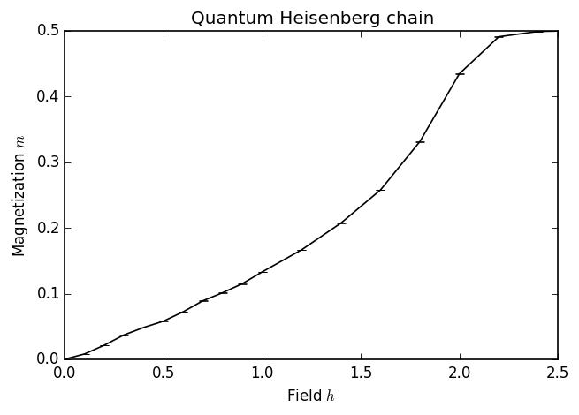
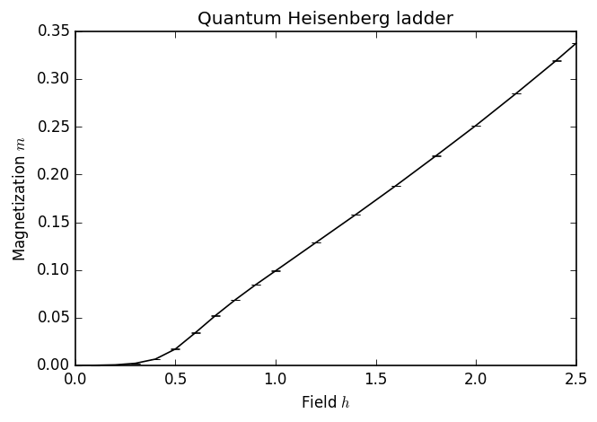
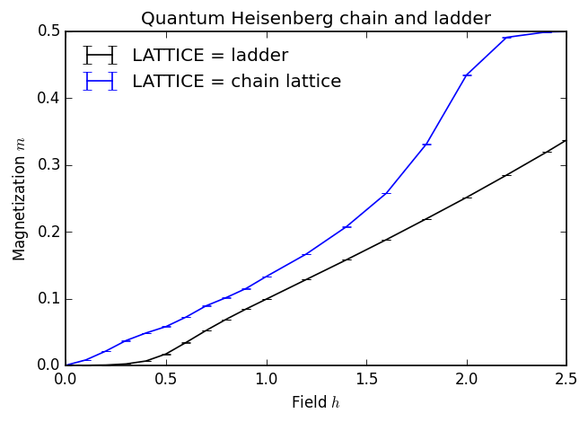

---
title: MC-09 Monte Carlo Cuántico
math: true
toc: true
weight: 11
---

```
import numpy as np
matplotlib inline
import matplotlib as mpl
mpl.rc("savefig", dpi=120)
import matplotlib.pyplot as plt

import pyalps
from pyalps.plot import plot
```

## Cadena de Heisenberg

En esta primera sección, calculamos la curva de magnetización de la cadena de Heisenberg $S=1/2$:
$$
H=\sum_{i}^{L}\vec{S}_i\cdot\vec{S}_{i+1}+h\sum_{i=1}^LS_i^z
$$
donde usamos condiciones de frontera periódicas, es decir, identificamos $\vec{S}_{L+1}=\vec{S}_1$.
Nos gustaría calcular la curva de magnetización en el estado fundamental. Sin embargo, el método que elegimos aquí es un método Monte Carlo cuántico de integral de camino que opera a temperatura finita. Por lo tanto, simulamos un ensemble térmico y elegimos una temperatura suficientemente baja en comparación con las demás escalas de energía del problema.

El valor esperado térmico de la magnetización por sitio se define como
$$
m=\frac{1}{L}\sum_i\langle S_i^z\rangle
$$
donde
$$
\langle S_i^z\rangle = \frac{1}{Z}\text{Tr}(e^{-H/T}S_i^z).
$$
Este es uno de los observables estándar calculados por la implementación de Directed Loop SSE en ALPS.

### Configuración de parámetros

Los parámetros que necesitamos pasar al código Directed Loop SSE se dividen en cuatro categorías:

- Parámetros de red: Elegimos la red etiquetada como "chain lattice". Esto corresponde a una simple cadena unidimensional con condiciones de frontera periódicas. Para esta red en particular, también necesitamos especificar la longitud de la cadena como el parámetro "L".

- Parámetros del modelo: Elegimos el modelo "spin" y fijamos $S=1/2$, lo cual se logra fijando "local_S" en 1/2. El acoplamiento es "J", y "h" es el campo magnético en la dirección Z.

- Parámetro de ensemble: Aquí elegimos una temperatura de $T=0.08$, que resulta ser suficientemente baja en este caso para ver el efecto físico que buscamos.

- Parámetros QMC: Para esta configuración simple, pasamos solo el número de barridos en la parte de termalización de la simulación ("THERMALIZATION"), y el número de barridos durante los cuales medimos el observable deseado ("SWEEPS").

**Sugerencias:** 

- Explore cómo cambiar la temperatura, así como el número de barridos de termalización y medición, afecta los resultados graficados abajo.

- ¿Puede pensar en una pauta para elegir una temperatura suficientemente baja para obtener la física del estado fundamental?

```
chain_parms = []
for h in [0., 0.1, 0.2, 0.3, 0.4, 0.5, 0.6, 0.7, 0.8, 0.9, 1.0, 1.2, 1.4, 1.6, 1.8, 2.0, 2.2, 2.4, 2.5]:
    chain_parms.append({
        # lattice parameters
        'LATTICE'        : "chain lattice", 
        'L'              : 20,

        # model parameters
        'MODEL'          : "spin",
        'local_S'        : 0.5,
        'J'              : 1,
        'h'              : h,

        # ensemble parameter
        'T'              : 0.08,

        # QMC parameters
        'THERMALIZATION' : 1000,
        'SWEEPS'         : 5000,
    })
chain_prefix = 'qmc_chain'
```

### Ejecutar la simulación

La simulación se realiza usando el código directed loop SSE, que es el más adecuado para simular un modelo de espín (con un pequeño número de estados por sitio) en un campo magnético externo.

```
# Write the input files for the ALPS codes.
# All the filenames will begin with the prefix chain_prefix='qmc_chain'.
input_file = pyalps.writeInputFiles(chain_prefix, chain_parms)

# The following command runs the applications.
res = pyalps.runApplication('dirloop_sse',input_file,Tmin=5)
```

Las líneas anteriores pueden guardarse en un script y ejecutarse con el comando python en su terminal. O el archivo de entrada puede ejecutarse con el siguiente comando de línea de comandos en su terminal:

```
dirloop_sse qmc_chain.in.xml --Tmin 5
```

### Analizar los resultados

Para el análisis de datos, nos apoyamos en los métodos disponibles como parte del paquete `pyalps`, así como en la biblioteca `matplotlib`.

```
# Load the raw measurement data. We only load the "Magnetization Density" and not all the other
# quantities measured by the QMC code.
data = pyalps.loadMeasurements(pyalps.getResultFiles(prefix=chain_prefix),'Magnetization Density')

# The pyalps.collectXY function takes a set of data points and extracts plots
# of the form "Y vs X".
magnetization = pyalps.collectXY(data, x='h', y='Magnetization Density')

plot(magnetization)
plt.xlabel('Field $h$')
plt.ylabel('Magnetization $m$')
plt.title('Quantum Heisenberg chain')
plt.show()
```

La imagen resultante debería verse como la siguiente:    


## Escalera de Heisenberg

Ahora resolvemos la escalera de Heisenberg de dos patas de manera muy similar. El hamiltoniano de la escalera puede pensarse como el acoplamiento de dos cadenas. Denotando los espines en una cadena $\vec{S}$ y en la otra $\vec{T}$, el hamiltoniano es

$$
H=\sum[J_0(\vec{S}_i\cdot\vec{S}_{i+1}+\vec{T}_i\cdot\vec{T}_{i+1})+J_1\vec{S}_i\cdot\vec{T}_i+h(S_i^z+T_i^z)],
$$

donde de nuevo aplicamos condiciones de frontera periódicas con la identificación $\vec{S}_{L+1}=\vec{S}_1$ y $\vec{T}_{L+1}=\vec{T}_1$.

Note la diferencia en los parámetros de red y del modelo:

- Además de la longitud del sistema, ahora también proporcionamos el ancho.
- El modelo ahora toma dos parámetros J0 y J1, donde J0 es el acoplamiento a lo largo de las cadenas y J1 el acoplamiento en los peldaños. Es importante especificar ambos parámetros, de lo contrario toman el valor predeterminado 0.

Mantenemos todos los demás parámetros iguales.

```
ladder_parms = []
for h in [0., 0.1, 0.2, 0.3, 0.4, 0.5, 0.6, 0.7, 0.8, 0.9, 1.0, 1.2, 1.4, 1.6, 1.8, 2.0, 2.2, 2.4, 2.5]:
    ladder_parms.append(
        { 
            # lattice parameters
            'LATTICE'        : "ladder", 
            'L'              : 20,
            'W'              : 2,
         
            # model parameters
            'MODEL'          : "spin",
            'local_S'        : 0.5,
            'J0'             : 1,
            'J1'             : 1,
            'h'              : h,
         
            # ensemble parameter
            'T'              : 0.08,
    
            # QMC parameters
            'THERMALIZATION' : 1000, # 1000
            'SWEEPS'         : 5000, # 20000
        }
    )
ladder_prefix = 'qmc_ladder'
    
input_file = pyalps.writeInputFiles(ladder_prefix, ladder_parms)
res = pyalps.runApplication('dirloop_sse',input_file,Tmin=5)

data = pyalps.loadMeasurements(pyalps.getResultFiles(prefix=ladder_prefix),'Magnetization Density')

magnetization = pyalps.collectXY(data,x='h',y='Magnetization Density')

plot(magnetization)
plt.xlabel('Field $h$')
plt.ylabel('Magnetization $m$')
plt.title('Quantum Heisenberg ladder')
```



## Comparación

Ahora comparamos los resultados para la cadena y la escalera. Para esto, no necesitamos ejecutar ninguna simulación nueva, sino simplemente cargar ambos conjuntos de datos al mismo tiempo e indicarle a pyalps.collectXY que cree un gráfico separado para cada valor del parámetro LATTICE.

- ¿Cuáles son las diferencias significativas entre los dos gráficos, particularmente en valores pequeños de la intensidad del campo h?
- ¿Cuál es la interpretación física de estas diferencias? ¿Cuál es su origen en el espectro del sistema?

Retomaremos estas preguntas en el tutorial de DMRG/MPS.

```
data = pyalps.loadMeasurements(pyalps.getResultFiles(prefix=ladder_prefix),'Magnetization Density')
data += pyalps.loadMeasurements(pyalps.getResultFiles(prefix=chain_prefix),'Magnetization Density')

# We here use the fourth, optional, parameter of the collectXY function, allowing
# us to pass a list of parameters such that collectXY creates a separate plot for
# each value of the parameters.
magnetization = pyalps.collectXY(data, 'h', 'Magnetization Density', ['LATTICE'])

plot(magnetization)
plt.xlabel('Field $h$')
plt.ylabel('Magnetization $m$')
plt.title('Quantum Heisenberg chain and ladder')
plt.legend(loc=0, frameon=False)
```



