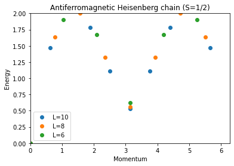

---
title: ED-03 Spectra
math: true
toc: true
---

## 一次元量子系のエネルギースペクトル

このチュートリアルでは、様々な一次元格子上での量子ハイゼンベルク模型のエネルギースペクトルを計算します。主な計算は、反復的な固有値解法である Lanczos アルゴリズムを実装した `sparsediag` アプリケーションによって行われます。
これまでのチュートリアルでの基底状態やギャップの計算とは異なり、ここでは*すべての*運動量セクターにおいて複数の低エネルギー固有値を計算し、運動量分解された励起スペクトル $E(k)$ を全体として組み立てます。これは、格子形状と結合の関数として低エネルギースペクトルの形を見るだけで、その模型がどのような励起を持つか——単一の分散するマグノン分枝、2スピノン連続帯、ギャップを持つ三重子束縛状態など——を判定するための基本的な診断手法です。

以下の3つの例（鎖、ラダー、孤立二量体）はいずれも、同一の二本脚ラダー上のハイゼンベルクハミルトニアン

$$
H = J_0 \sum_{\text{legs}} \mathbf{S}_i \cdot \mathbf{S}_j \; + \; J_1 \sum_{\text{rungs}} \mathbf{S}_i \cdot \mathbf{S}_j ,
$$

の特別な場合です。ここで $J_0$ は両方の脚に沿った結合、$J_1$ はラング（横木）を横切る結合です。$J_0=J_1$ とすると等方的なラダーになり、$J_1=0$ とすると2本の独立した鎖になり、$J_0=0$ とすると $L$ 個の孤立した2サイト二量体になります。この一連の模型群とその極限間のクロスオーバーについては、例えば [E. Dagotto and T.M. Rice, Science 271, 618 (1996)](https://doi.org/10.1126/science.271.5249.618) で議論されています。

### パラメータ

| パラメータ | 意味 | 値 |
|---|---|---|
| `LATTICE` | 内蔵の幾何構造 | `chain lattice`（鎖）または `ladder`（ラダー／二量体） |
| `MODEL` | 量子スピン模型 | `spin` |
| `local_S` | 各サイトのスピン量子数 | 1/2 |
| `J` | 最近接結合（chain lattice） | 1 |
| `J0` | 脚方向の結合（ladder lattice） | 1（ラダー）または 0（孤立二量体） |
| `J1` | ラング結合（ladder lattice） | 1 |
| `L` | 線形サイズ（ラダーのラング数） | 10〜16（鎖）、6〜10（ラダー／二量体） |
| `CONSERVED_QUANTUMNUMBERS`、`Sz_total` | $S_z=0$ セクターに制限する | `Sz`, 0 |

### 手法

$E(k)$ を組み立てるには基底状態だけでなく*すべての運動量セクターにおいて*複数の最低固有値が必要なため、`sparsediag` を使用します。Lanczos アルゴリズムは、興味のないセクターを対角化することなく、スパースハミルトニアンの任意個数の極値固有値を直接計算します。ここで最大のセクター（鎖、$L=16$、$S_z=0$）は次元 $\binom{16}{8}=12870$ であり、反復的なスパース対角化であれば余裕を持って扱える一方、手作業で列挙するにはあまりに大きすぎます。

### ハイゼンベルク鎖

`chain lattice`（[ALPS格子ライブラリ](../../../documentation/intro/latticehowtos)に内蔵）は、一様な結合 $J$ を持つ $L$ サイトの周期的な環です。

```
    J     J     J           J
o-------o-------o--- ... ---o
0       1       2          L-1
|_________________________________|
                J   (bond L-1 -- 0, periodic)
```

#### コマンドラインでシミュレーションを準備・実行する

まず、ハイゼンベルク結合を持つ S=1/2 スピンの鎖を見てみましょう。パラメータファイル <a href="../codes/ed-03-1dspectra/parm_chain" download>`parm_chain`</a> は、{L=10,...16} スピンの鎖について S_z=0 セクターの ED シミュレーションを設定します。

```
LATTICE = "chain lattice", 
MODEL = "spin",
local_S = 0.5,
J = 1,
CONSERVED_QUANTUMNUMBERS = "Sz"
Sz_total = 0
{ L = 10; }
{ L = 12; }
{ L = 14; }
{ L = 16; }
```
    
以下の一連のコマンドを使えば対角化を実行でき、その後ブラウザで出力ファイル `parm_chain.out.xml` を見ることができます。

```
parameter2xml parm_chain
sparsediag --write-xml parm_chain.in.xml
```

#### Python でシミュレーションを準備・実行する

Python でシミュレーションを設定・実行するには、スクリプト <a href="../codes/ed-03-1dspectra/chain.py" download>`chain.py`</a> を使用します。ターミナルで `python chain.py` として実行できます。
スクリプトの各部分を見ていくと、必要なモジュールをインポートした後、入力ファイルが Python の辞書のリストとして準備される様子がわかります。

```
import pyalps
import numpy as np
import matplotlib.pyplot as plt
import pyalps.plot

parms=[]
for l in [10, 12, 14, 16]:
    parms.append({ 
        'LATTICE'                   : "chain lattice", 
        'MODEL'                     : "spin",
        'local_S'                   : 0.5,
        'J'                         : 1,
        'L'                         : l,
        'CONSERVED_QUANTUMNUMBERS'  : 'Sz',
        'Sz_total'                  : 0
    })
```

続いて、入力パラメータが XML ジョブファイルに書き出され、`sparsediag` シミュレーションが実行されます。

```
input_file = pyalps.writeInputFiles('parm_chain',parms)
res = pyalps.runApplication('sparsediag',input_file)
```
    
スペクトルをプロットするために、シミュレーションが生成した HDF5 ファイルを読み込みます。

```
data = pyalps.loadSpectra(pyalps.getResultFiles(prefix='parm_chain'))
```
    
そして、各システムサイズ L について、すべての運動量セクターのエネルギーを1つの DataSet に集めます。見やすいプロットにするために、さらにすべての固有値から基底状態エネルギーを差し引き、各スペクトルにラベルと線のスタイルを割り当てます。

```
spectra = {}
for sim in data:
    l = int(sim[0].props['L'])
    all_energies = []
    spectrum = pyalps.DataSet()
    for sec in sim:
        all_energies += list(sec.y)
        spectrum.x = np.concatenate((spectrum.x,np.array([sec.props['TOTAL_MOMENTUM'] for i in range(len(sec.y))])))
        spectrum.y = np.concatenate((spectrum.y,sec.y))
        spectrum.y -= np.min(all_energies)
    spectrum.props['line'] = 'scatter'
    spectrum.props['label'] = 'L='+str(l)
    spectra[l] = spectrum
```
    
これで、異なるシステムサイズのスペクトルを1つの図にまとめてプロットできます。

```
plt.figure()
pyalps.plot.plot(spectra.values())
plt.legend()
plt.title('Antiferromagnetic Heisenberg chain (S=1/2)')
plt.ylabel('Energy')
plt.xlabel('Momentum')
plt.xlim(0,2*3.1416)
plt.ylim(0,2)
plt.show()
```

ハイゼンベルク鎖についてプロットされたエネルギースペクトルを以下に示します。


### 二本脚ハイゼンベルクラダー

上で用いた入力パラメータをわずかに変更するだけで、二本脚ハイゼンベルクスピンラダーのスペクトルを計算できます。`ladder` 格子は、$2L$ 個のサイトを $L$ 個ずつの2行に配置し、脚方向の結合 $J_0$ とラング結合 $J_1$ で結びます。

```
o---J0---o---J0---o---...---o     leg 0
|        |        |         |
J1       J1       J1        J1
|        |        |         |
o---J0---o---J0---o---...---o     leg 1
```

新しいパラメータテキストファイル <a href="../codes/ed-03-1dspectra/parm_ladder" download>`parm_ladder`</a> は次のようになります。

```
LATTICE = "ladder"
MODEL = "spin"
local_S = 0.5
J0 = 1
J1 = 1
CONSERVED_QUANTUMNUMBERS = "Sz"
Sz_total = 0
{ L = 6; }
{ L = 8; }
{ L = 10; }
```
    
"chain lattice" を "ladder" に置き換え、脚方向とラング方向にそれぞれ別々の結合定数 J0、J1 を定義しただけです。それ以外にも、ラダーは 2L 個のスピンを持つため、線形システムサイズ L を小さくしています。
以前と全く同じ方法で実行します。

```
parameter2xml parm_ladder
sparsediag --write-xml parm_ladder.in.xml
```

Python コードにも同じ変更を加える必要があります。こちらからダウンロードできます：<a href="../codes/ed-03-1dspectra/ladder.py" download>`ladder.py`</a>

様々な格子サイズについてのハイゼンベルクラダーのエネルギースペクトルを以下に示します。


### 孤立二量体

ラダーの脚方向の結合を J0 = 0 とすると、L 個の孤立二量体のスペクトルが得られます——各ラングが独立した2サイトの一重項/三重項問題へと分離するため、「スペクトル」はどの運動量の値についても、ちょうど2つの厳密に縮退した準位（一重項 $E=-3J_1/4$ と、平坦な三重項バンド $E=+J_1/4$）に潰れます。これはパラメータファイル <a href="../codes/ed-03-1dspectra/parm_dimers" download>`parm_dimers`</a> によって実現されます。

```
LATTICE = "ladder"
MODEL = "spin"
local_S = 0.5
J0 = 0
J1 = 1
CONSERVED_QUANTUMNUMBERS = "Sz"
Sz_total = 0
{ L = 6; }
{ L = 8; }
{ L = 10; }
```

および Python スクリプト <a href="../codes/ed-03-1dspectra/dimers.py" download>`dimers.py`</a>。同じ方法で実行します。

```
parameter2xml parm_dimers
sparsediag --write-xml parm_dimers.in.xml
```

孤立二量体のエネルギースペクトルを以下に示します。


## まとめ

結合定数を1つ（$J_0$）オン・オフするだけで、励起スペクトルは分散のない平坦バンド（孤立二量体）から、束縛状態と連続帯の構造を持つ2分枝スペクトル（ラダー）を経て、単一鎖のギャップレスな2スピノン連続帯へと連続的に変化します——これは、スペクトルの形だけで系の低エネルギー励起の性質が明らかになることを示しています。

### 問題

- 異なるシステムサイズのスペクトルを組み合わせることで、きれいなバンドができる様子を観察してください
- ハイゼンベルクラダーのスペクトルにおいて、連続帯と束縛状態を同定してください
- 鎖のスペクトルとラダーのスペクトルの主な違いは何ですか。
- 孤立二量体のスペクトルを説明してください
- ラダーの結合定数を変化させ、これまでに議論した極限の間でスペクトルがどのように変化するかを観察してください
- ボーナス問題：異なるシステムサイズについて鎖のスペクトルをよく見てください。L/2 が偶数の場合と奇数の場合とで違いがあるように見えます。これを説明できますか。L が無限大になる熱力学極限では何が起こるでしょうか。
