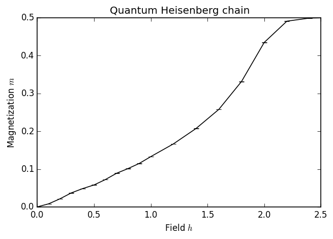
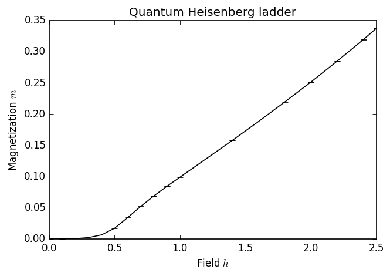
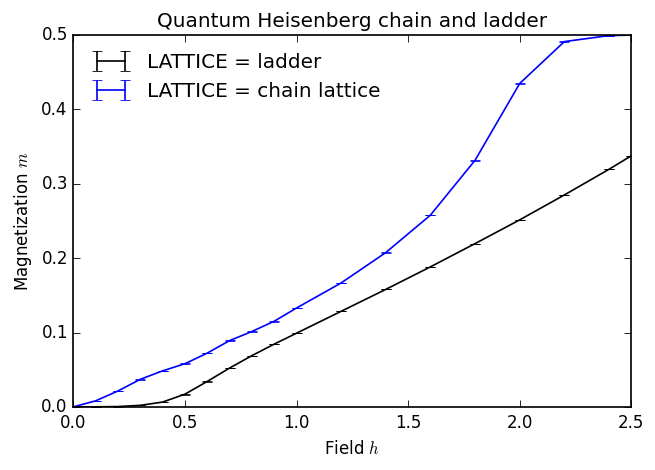

---
title: MC-09 量子モンテカルロ
math: true
toc: true
weight: 11
---

```
import numpy as np
matplotlib inline
import matplotlib as mpl
mpl.rc("savefig", dpi=120)
import matplotlib.pyplot as plt

import pyalps
from pyalps.plot import plot
```

## ハイゼンベルク鎖

この最初の節では、 $S=1/2$  ハイゼンベルク鎖の磁化曲線を計算します。
$$
H=\sum_{i}^{L}\vec{S}_i\cdot\vec{S}_{i+1}+h\sum_{i=1}^LS_i^z
$$
ここでは周期境界条件を用います。すなわち $\vec{S}_{L+1}=\vec{S}_1$ と同一視します。
本来は基底状態における磁化曲線を計算したいところですが、ここで選ぶ手法は有限温度で動作する経路積分量子モンテカルロ法です。そのため熱的アンサンブルをシミュレートし、問題の他のエネルギースケールに比べて十分に低い温度を選びます。

1 サイトあたりの磁化の熱期待値は次のように定義されます。
$$
m=\frac{1}{L}\sum_i\langle S_i^z\rangle
$$
ここで
$$
\langle S_i^z\rangle = \frac{1}{Z}\text{Tr}(e^{-H/T}S_i^z).
$$
これは ALPS の有向ループ SSE 実装が計算する標準的な物理量の一つです。

### パラメータの設定

有向ループ SSE コードに渡す必要のあるパラメータは、次の 4 つのカテゴリに分かれます。

- 格子パラメータ：ここでは "chain lattice" というラベルの格子を選びます。これは周期境界条件をもつ単純な一次元鎖に対応します。この特定の格子については、鎖の長さをパラメータ "L" として指定する必要もあります。

- モデルパラメータ："spin" モデルを選び、 $S=1/2$  と設定します。これは "local_S" を 1/2 に設定することで実現されます。結合は "J"、"h" は $z$ 方向の磁場です。

- アンサンブルパラメータ：ここでは温度を  $T=0.08$  とします。これは目的とする物理的効果を見るのに十分低い値です。

- QMC パラメータ：この単純な設定では、シミュレーションの熱化部分におけるスイープ数（"THERMALIZATION"）と、目的の物理量を測定するスイープ数（"SWEEPS"）のみを渡します。

**提案：** 

- 温度や熱化・測定スイープ数を変えると、下にプロットされる結果がどのように変化するかを調べてみてください。

- 基底状態の物理を得るのに十分低い温度を選ぶための指針を考えられますか。

```
chain_parms = []
for h in [0., 0.1, 0.2, 0.3, 0.4, 0.5, 0.6, 0.7, 0.8, 0.9, 1.0, 1.2, 1.4, 1.6, 1.8, 2.0, 2.2, 2.4, 2.5]:
    chain_parms.append({
        # 格子パラメータ
        'LATTICE'        : "chain lattice", 
        'L'              : 20,

        # モデルパラメータ
        'MODEL'          : "spin",
        'local_S'        : 0.5,
        'J'              : 1,
        'h'              : h,

        # アンサンブルパラメータ
        'T'              : 0.08,

        # QMC パラメータ
        'THERMALIZATION' : 1000,
        'SWEEPS'         : 5000,
    })
chain_prefix = 'qmc_chain'
```

### シミュレーションの実行

シミュレーションは有向ループ SSE コードを用いて行います。このコードは外部磁場中のスピンモデル（1 サイトあたりの状態数が少ないもの）のシミュレーションに最も適しています。

```
# ALPS コード用の入力ファイルを書き出します。
# すべてのファイル名は接頭辞 chain_prefix='qmc_chain' で始まります。
input_file = pyalps.writeInputFiles(chain_prefix, chain_parms)

# 次のコマンドでアプリケーションを実行します。
res = pyalps.runApplication('dirloop_sse',input_file,Tmin=5)
```

上記の行はスクリプトとして保存し、ターミナルで python コマンドを使って実行できます。あるいは、入力ファイルをターミナルで次のコマンドを使って実行することもできます。

```
dirloop_sse qmc_chain.in.xml --Tmin 5
```

### 結果の解析

データ解析には、`pyalps` パッケージに含まれるメソッドと `matplotlib` ライブラリを利用します。

```
# 生の測定データを読み込みます。QMC コードが測定した他のすべての物理量ではなく、
# "Magnetization Density" のみを読み込みます。
data = pyalps.loadMeasurements(pyalps.getResultFiles(prefix=chain_prefix),'Magnetization Density')

# pyalps.collectXY 関数はデータ点の集合を受け取り、"Y vs X" の形式の
# プロットを抽出します。
magnetization = pyalps.collectXY(data, x='h', y='Magnetization Density')

plot(magnetization)
plt.xlabel('Field $h$')
plt.ylabel('Magnetization $m$')
plt.title('Quantum Heisenberg chain')
plt.show()
```

得られる図は次のようになるはずです。    


## ハイゼンベルク梯子

次に、2 レッグのハイゼンベルク梯子をほぼ同じ方法で解きます。梯子のハミルトニアンは、2 本の鎖を互いに結合させたものと考えることができます。一方の鎖のスピンを $\vec{S}$ 、もう一方のスピンを $\vec{T}$ と表すと、ハミルトニアンは次のようになります。

$$
H=\sum[J_0(\vec{S}_i\cdot\vec{S}_{i+1}+\vec{T}_i\cdot\vec{T}_{i+1})+J_1\vec{S}_i\cdot\vec{T}_i+h(S_i^z+T_i^z)],
$$

ここでも周期境界条件を適用し、$\vec{S}_{L+1}=\vec{S}_1$ および $\vec{T}_{L+1}=\vec{T}_1$ と同一視します。

格子パラメータとモデルパラメータの違いに注意してください。

- 系の長さに加えて、ここでは幅も指定します。
- モデルは 2 つのパラメータ $J_0$ と $J_1$ を取ります。$J_0$ は鎖に沿った結合、$J_1$ はラング上の結合です。両方のパラメータを指定することが重要です。指定しない場合、既定値は 0 になります。

その他のパラメータはすべて同じままにします。

```
ladder_parms = []
for h in [0., 0.1, 0.2, 0.3, 0.4, 0.5, 0.6, 0.7, 0.8, 0.9, 1.0, 1.2, 1.4, 1.6, 1.8, 2.0, 2.2, 2.4, 2.5]:
    ladder_parms.append(
        { 
            # 格子パラメータ
            'LATTICE'        : "ladder", 
            'L'              : 20,
            'W'              : 2,
         
            # モデルパラメータ
            'MODEL'          : "spin",
            'local_S'        : 0.5,
            'J0'             : 1,
            'J1'             : 1,
            'h'              : h,
         
            # アンサンブルパラメータ
            'T'              : 0.08,
    
            # QMC パラメータ
            'THERMALIZATION' : 1000, # 1000
            'SWEEPS'         : 5000, # 20000
        }
    )
ladder_prefix = 'qmc_ladder'
    
input_file = pyalps.writeInputFiles(ladder_prefix, ladder_parms)
res = pyalps.runApplication('dirloop_sse',input_file,Tmin=5)

data = pyalps.loadMeasurements(pyalps.getResultFiles(prefix=ladder_prefix),'Magnetization Density')

magnetization = pyalps.collectXY(data,x='h',y='Magnetization Density')

plot(magnetization)
plt.xlabel('Field $h$')
plt.ylabel('Magnetization $m$')
plt.title('Quantum Heisenberg ladder')
```



## 比較

ここで、鎖と梯子の結果を比較します。そのために新しいシミュレーションを実行する必要はなく、両方のデータセットを同時に読み込み、LATTICE パラメータの値ごとに別々のプロットを作成するよう pyalps.collectXY に指示するだけです。

- 2 つのプロットの間の顕著な違いは何でしょうか。とくに磁場の強さ h が小さい領域ではどうでしょうか。
- これらの違いの物理的な解釈は何でしょうか。それぞれの系の励起スペクトルはこれをどのように説明するでしょうか。

これらの問いは DMRG のチュートリアルシリーズで再び取り上げます。

```
data = pyalps.loadMeasurements(pyalps.getResultFiles(prefix=ladder_prefix),'Magnetization Density')
data += pyalps.loadMeasurements(pyalps.getResultFiles(prefix=chain_prefix),'Magnetization Density')

# ここでは collectXY 関数の 4 番目のオプション引数を使います。これによりパラメータの
# リストを渡すことができ、collectXY はそれらのパラメータの値ごとに別々のプロットを
# 作成します。
magnetization = pyalps.collectXY(data, 'h', 'Magnetization Density', ['LATTICE'])

plot(magnetization)
plt.xlabel('Field $h$')
plt.ylabel('Magnetization $m$')
plt.title('Quantum Heisenberg chain and ladder')
plt.legend(loc=0, frameon=False)
```



