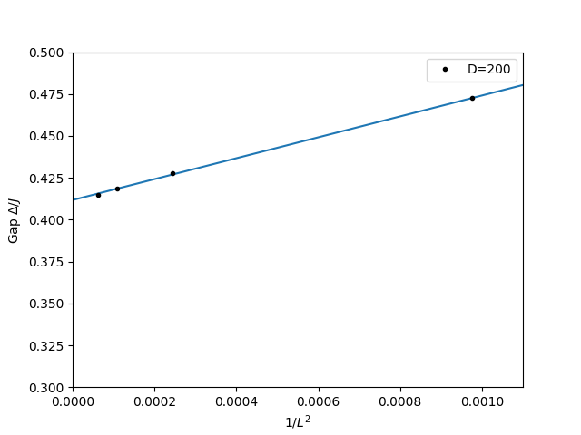

In this tutorial, we will perform multiple DMRG simulations of a spin-1 chain with various lattice sizes: 32, 64, 96, and 128. The energy gaps will be calculated for each lattice size and used to extrapolate the gap value in the thermodynamic limit $L\rightarrow\infty$, based on a known analytic relation between the gaps and lattice sizes. Our DMRG simulations will have a fixed number of states $D=200$.

We first import the necessary libraries.


```python
import pyalps
import numpy as np
import matplotlib.pyplot as plt
import pyalps.plot
import pyalps.fit_wrapper as fw
```

We prepare the input files with various lattice sizes 32, 64, 96, and 128 for multiple runs.


```python
parms= []
for lattice in [32, 64, 96, 128]:
    parms.append({
            'LATTICE'                   : "open chain lattice",
            'MODEL'                     : "spin",
            'local_S'                   : '1',
            'CONSERVED_QUANTUMNUMBERS'  : 'Sz',
            'Sz_total'                  : 0,
            'J'                         : 1,
            'SWEEPS'                    : 5,
            'L'                         : lattice,
            'MAXSTATES'                 : 200,
            'NUMBER_EIGENVALUES'        : 4
        })
```

Note that we will keep the lowest 4 energies in each DMRG run, since the ground state has 2-fold degeneracy, as known from the previous tutorial.

We then write the input files and run the simulations. Warning: the simulation will take a while (about 20 - 30 minutes depending on the computer system you have). You can leave it running and come back later!


```python
input_file = pyalps.writeInputFiles('parm_spin_one_gap_multiple',parms)
res = pyalps.runApplication('dmrg',input_file,writexml=True)
```

When all the simulations are done, we load all measurements for all lattices and sort the results according to the lattice sizes. 


```python
data = pyalps.loadEigenstateMeasurements(pyalps.getResultFiles(prefix='parm_spin_one_gap_multiple'))

sorted_data = sorted(data, key=lambda x: x[0].props['L'])
```

A data set is created for the pyalps plot function. The energy gaps for each lattice size are also included in the data set.


```python
gapplot = pyalps.DataSet()
gapplot.props['xlabel']='$1/L^2$'
gapplot.props['ylabel']='Gap $\Delta/J$'
gapplot.props['label']='D=200'
gapplot.props['line']='.'

x = []
y = []
for measure in sorted_data:
    for s in measure:
        if s.props['observable'] == 'Energy':
            L = s.props['L']
            iL = (1.0/L)**2
            gap = abs(s.y[2] - s.y[1])
            s.props['gap'] = gap
            x.append(iL)
            y.append(gap)

gapplot.x = x
gapplot.y = y
```

Note that the $x$-axis is $1/L^2$, which is different from the spin-1/2 case. This is due to the analytic relation between the energy gaps and lattice sizes, as analyzed by Haldane with the nonlinear sigma model for the lowest excitations around $k=\pi$,
$$
E(k)=E_0+\sqrt{\Delta^2+c^2(k-\pi)^2}.
$$
For the open boundary conditions, we may approximate $k-\pi$ by $1/L$, which gives a finite-system energy gap of 
$$
\Delta(L)\approx\Delta(1+\frac{c^2}{2\Delta^2L^2}).
$$
This indicates that in the asymptotic limit the gap convergence should be as $1/L^2$. 

Therefore, we plot the energy gap vs. $1/L^2$ relation, which is fitted with a linear curve. The intercept of the fitted curve (plotted in the same figure) with the vertical axis gives the energy gap value in the thermodynamic limit $L\rightarrow\infty$.


```python
# create data set for plot: gap vs. (1/L)^2
gapplot = pyalps.DataSet()
gapplot.props['xlabel']='$1/L^2$'
gapplot.props['ylabel']='Gap $\Delta/J$'
gapplot.props['label']='D=200'
gapplot.props['line']='.'

x = []
y = []
for measure in sorted_data:
    for s in measure:
        if s.props['observable'] == 'Energy':
            L = s.props['L']
            iL = (1.0/L)**2
            gap = abs(s.y[2] - s.y[1])
            s.props['gap'] = gap
            x.append(iL)
            y.append(gap)

gapplot.x = x
gapplot.y = y

# plot the gap vs. (1/L)^2 curve:
plt.figure()
pyalps.plot.plot(gapplot)
plt.legend()
plt.xlim(0,0.0011)
plt.ylim(0.3,0.5)

# fit the curve with a linear function
pars = [fw.Parameter(0.1), fw.Parameter(0.2)]
f = lambda self, x, p: p[0]()+p[1]()*x
fw.fit(None, f, pars, np.array(gapplot.y), np.array(gapplot.x))

# plot the fitted curve
x = np.linspace(0.0, 0.0011, 100)
plt.plot(x, f(None,x,pars))

print("Gap at thermodynamic limit: ", pars[0]())

plt.show()
```

The final energy gap value should be $\Delta/J=0.41176$, which is close to the exact value $\Delta/J=0.41052$. The figure should look like the following:

