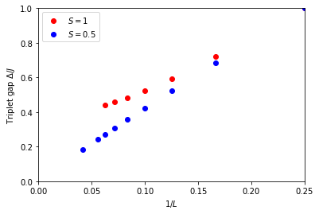

---
title: ED-02 Gaps
math: true
toc: true
---

## 一维量子自旋系统的自旋能隙

在本教程中，我们将使用稀疏对角化程序来计算一维量子自旋系统的自旋能隙，并研究其有限尺寸标度行为。
对任何反铁磁自旋链而言，一个核心问题是它在基态之上是否存在有限的激发能隙，还是无能隙的。Haldane 曾猜想——如今已通过数值计算和场论论证被牢固确立——各向同性海森堡链的行为完全取决于自旋量子数 $S$ 是整数还是半整数：整数自旋链具有唯一的、带能隙的基态（即"Haldane 能隙"），而半整数自旋链是无能隙的，其关联呈幂律衰减（[F.D.M. Haldane, Phys. Rev. Lett. 50, 1153 (1983)](https://doi.org/10.1103/PhysRevLett.50.1153)）。由于有限系统总是具有离散谱，这种定性差异只有在将有限尺寸能隙外推到 $L\to\infty$ 之后才能显现出来——这正是我们下面针对 $S=1$ 和 $S=1/2$ 所要做的事情。

两种情形下的哈密顿量都是各向同性海森堡链，

$$
H = J \sum_{\langle i,j \rangle} \mathbf{S}_i \cdot \mathbf{S}_j , \qquad J=1 ,
$$

定义在有 $L$ 个格点的周期链上，二者仅在局域自旋大小 $S$ 上有所不同。

### 参数

| 参数 | 含义 | 取值 |
|---|---|---|
| `LATTICE` | 周期链 | `chain lattice` |
| `MODEL` | 量子自旋模型 | `spin` |
| `local_S` | 每个格点的自旋量子数 | 1（`parm2a`）或 1/2（`parm2b`） |
| `J` | 最近邻海森堡耦合 | 1 |
| `L` | 链长 | 4, 6, 8, 10 |
| `CONSERVED_QUANTUMNUMBERS` | 用于将 $H$ 分块对角化的对称性 | `Sz` |
| `Sz_total` | 将对角化限制在单一 $S_z$ 子空间内 | 0（单态子空间）和 1（三重态子空间） |

### 格子

两条链都使用 [ALPS 格子库](../../../documentation/intro/latticehowtos)中内置的周期性 `chain lattice`，以下以 $L=6$ 为例示意：

```
    J     J     J     J     J
o-------o-------o-------o-------o-------o
0       1       2       3       4       5
|_______________________________________|
                   J   (bond 5-0, periodic)
```

### 方法

分别在 $S_z=0$ 和 $S_z=1$ 子空间中对角化，并取各自的最低本征值，就可以分离出单态基态和最低的三重态激发，而无需搜索（大得多的）完整谱。即使这里最大的子空间（$S=1$，$L=10$，维数 $8953$）也很容易被 `sparsediag` 背后的 Lanczos 迭代处理；由于我们只需要每个子空间中的最低态，全对角化既没有必要，代价也会大得多。

### S=1 链的自旋能隙

#### 使用命令行
参数文件 <a href="../codes/ed-02-gaps/parm2a" download>`parm2a`</a> 为具有 4 到 10 个格点的量子力学 S=1 链，在单态和三重态子空间中设置了精确对角化：

```
MODEL="spin"
LATTICE="chain lattice"
CONSERVED_QUANTUMNUMBERS="Sz"
local_S=1
J=1
Sz_total=0
{L=4}
{L=6}
{L=8}
{L=10}
Sz_total=1
{L=4}
{L=6}
{L=8}
{L=10}
```
    
参数 Sz_total 将守恒量子数 Sz 限制为给定值。关于如何设置模型和守恒量子数的更多细节，请参阅模型库文档。
按照标准的命令序列，你可以先将输入参数转换为 XML，然后运行应用程序 `sparsediag`：

```
parameter2xml parm2a
sparsediag --write-xml parm2a.in.xml
```
    
现在可以通过查看输出文件手动完成能隙的计算，也可以使用 Python 来自动化整个流程。

#### 使用 Python
要在 Python 中设置并运行该模拟，我们使用脚本 <a href="../codes/ed-02-gaps/tutorial2a.py" download>`tutorial2a.py`</a>。该脚本的前几部分导入所需模块，将输入参数准备为一个 Python 字典列表，写入输入文件并运行应用程序：

```
import pyalps
import numpy as np
import matplotlib.pyplot as plt
import pyalps.pyplot
parms = []
for l in [4, 6, 8, 10]:
    for sz in [0, 1]:
        parms.append({ 
            'LATTICE'                   : "chain lattice", 
            'MODEL'                     : "spin",
            'local_S'                   : 1,
            'J'                         : 1,
            'L'                         : l,
            'CONSERVED_QUANTUMNUMBERS'  : 'Sz',
            'Sz_total'                  : sz
        })
     
input_file = pyalps.writeInputFiles('parm2a',parms)
res = pyalps.runApplication('sparsediag',input_file)
```
    
要运行它，在终端中输入 `python tutorial2a.py`。我们现在得到了与命令行版本相同的输出文件。
接下来我们加载每个系统尺寸和自旋子空间的能谱：

```
data = pyalps.loadSpectra(pyalps.getResultFiles(prefix='parm2a'))
```
    
要提取能隙，我们需要写几行 Python 代码，建立一个长度列表，以及一个记录每个 (L,Sz) 子空间最小能量的 Python 字典：

```
lengths = []
min_energies = {}
for sim in data:
    l = int(sim[0].props['L'])
    if l not in lengths: lengths.append(l)
    sz = int(sim[0].props['Sz_total'])
    all_energies = []
    for sec in sim:
        all_energies += list(sec.y)
    min_energies[(l,sz)]= np.min(all_energies)
```

最后我们绘制能隙随 1/L 变化的图像并显示出来：
    
```
gapplot = pyalps.DataSet()
gapplot.x = 1./np.sort(lengths)
gapplot.y = [min_energies[(l,1)] -min_energies[(l,0)] for l in np.sort(lengths)]  
gapplot.props['xlabel']='$1/L$'
gapplot.props['ylabel']='Triplet gap $\Delta/J$'
gapplot.props['label']='S=1'

plt.figure()
pyalps.plot.plot(gapplot)
plt.legend()
plt.xlim(0,0.25)
plt.ylim(0,1.0)
plt.show()
```

## S=1/2 链的自旋能隙

将 S=1 链外推得到的能隙与 S=1/2 链的能隙进行比较。为此，只需将 local_S=1 改为 local_S=0.5 并运行模拟（但将其命名为 `parm2b`）。参数文件 <a href="../codes/ed-02-gaps/parm2b" download>`parm2b`</a> 除此之外与 `parm2a` 完全相同：

```
MODEL="spin"
LATTICE="chain lattice"
CONSERVED_QUANTUMNUMBERS="Sz"
local_S=1/2
J=1
Sz_total=0
{L=4}
{L=6}
{L=8}
{L=10}
Sz_total=1
{L=4}
{L=6}
{L=8}
{L=10}
```

Python 脚本为 <a href="../codes/ed-02-gaps/tutorial2b.py" download>`tutorial2b.py`</a>。

## 将两个系统绘制在同一张图中

在运行完前两个教程之后，运行 Python 脚本 <a href="../codes/ed-02-gaps/tutorial2c.py" download>`tutorial2c.py`</a> 可以将两条链的能隙绘制在同一张图中。
自旋 1/2 和自旋 1 两种情形下能隙随格子尺寸变化的关系绘制在下图中：


### 输出数据

下表列出了由两个参数文件得到的精确三重态能隙 $\Delta(L)=E_0(S_z=1)-E_0(S_z=0)$，供你与自己的运行结果对照：

| $L$ | $1/L$ | 能隙 $\Delta/J$，S=1 | 能隙 $\Delta/J$，S=1/2 |
|---|---|---|---|
| 4  | 0.250 | 1.0000 | 1.0000 |
| 6  | 0.167 | 0.7206 | 0.6847 |
| 8  | 0.125 | 0.5936 | 0.5227 |
| 10 | 0.100 | 0.5248 | 0.4232 |

S=1 的能隙正在趋于平缓，并外推（例如用 $1/L$ 的二次拟合）到一个接近文献中 Haldane 能隙估计值 $\Delta_\infty \approx 0.41\,J$ 的有限值；而 S=1/2 的能隙则持续减小，与外推到零的结果相符——这正是无能隙链的标志。

## 总结

在相同的最近邻反铁磁海森堡耦合下，S=1 链外推得到有限的激发能隙，而 S=1/2 链外推得到零能隙，这在可以精确对角化的小链上直接验证了 Haldane 猜想。

## 问题

- 对于无限系统，外推得到的能隙值是多少？
- 为什么 S=1/2 和 S=1 链表现出不同的行为？
- 对上表中 S=1 的数据尝试二次拟合 $\Delta(L) = \Delta_\infty + a/L + b/L^2$。你外推得到的 $\Delta_\infty$ 与文献值 $\approx 0.41 J$ 有多接近？
