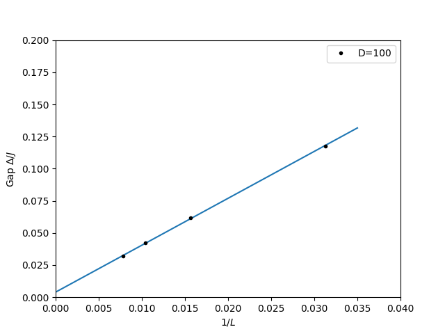

In this tutorial, we will calculate energy gap for a spin-1/2 chain with various lattice sizes: 32, 64, 96, and 128. We will fix the number of states in the DMRG simulation to $D=100$, which produces results with enough accuracy. The energy gaps vs lattice sizes will be plotted and extrapolated to the thermodynamic limit. 

We first import the necessary libraries.


```python
import pyalps
import numpy as np
import matplotlib.pyplot as plt
import pyalps.plot
import pyalps.fit_wrapper as fw
```

We prepare the input files with various lattice sizes for multiple runs.


```python
parms= []
for lattice in [32, 64, 96, 128]:
    parms.append({
            'LATTICE'                   : "open chain lattice",
            'MODEL'                     : "spin",
            'CONSERVED_QUANTUMNUMBERS'  : 'Sz',
            'Sz_total'                  : 0,
            'J'                         : 1,
            'SWEEPS'                    : 4,
            'L'                         : lattice,
            'MAXSTATES'                 : 100,
            'NUMBER_EIGENVALUES'        : 2
        })
```

Notice that we have set the maximum number of states to be kept in the DMRG simulations. The lowest two eigin values will be kept and used to calculate the energy gap. 

We then write the input files and run the simulations.


```python
input_file = pyalps.writeInputFiles('parm_spin_one_half_gap_multiple',parms)
res = pyalps.runApplication('dmrg',input_file,writexml=True)
```

After the simulations, we load all measurements for all lattices and sort the results according to the lattice sizes.


```python
data = pyalps.loadEigenstateMeasurements(pyalps.getResultFiles(prefix='parm_spin_one_half_gap_multiple'))

sorted_data = sorted(data, key=lambda x: x[0].props['L'])
```

A data set is created for the pyalps plot function. The energy gaps for each lattice size are also included in the data set.


```python
gapplot = pyalps.DataSet()
gapplot.props['xlabel']='$1/L$'
gapplot.props['ylabel']='Gap $\Delta/J$'
gapplot.props['label']='D=100'
gapplot.props['line']='.'

x = []
y = []
for measure in sorted_data:
    for s in measure:
        if s.props['observable'] == 'Energy':
            L = s.props['L']
            iL = 1.0/L
            gap = abs(s.y[1] - s.y[0])
            s.props['gap'] = gap
            x.append(iL)
            y.append(gap)

gapplot.x = x
gapplot.y = y
```

We plot the energy gap vs 1/L relation, which is fitted with a linear curve. The fitted curve is also plotted in the same figure.


```python
# plot the gap vs. 1/L curve:
plt.figure()
pyalps.plot.plot(gapplot)
plt.legend()
plt.xlim(0,0.04)
plt.ylim(0,0.2)

# fit the curve with a linear function
pars = [fw.Parameter(0.1), fw.Parameter(0.2)]
f = lambda self, x, p: p[0]()+p[1]()*x
fw.fit(None, f, pars, np.array(gapplot.y), np.array(gapplot.x))

# plot the fitted curve
x = np.linspace(0.0, 0.035, 100)
plt.plot(x, f(None,x,pars))

print("Gap at thermodynamic limit: ", pars[0]())

plt.show()
```

The final energy gap figure should look like the following:

